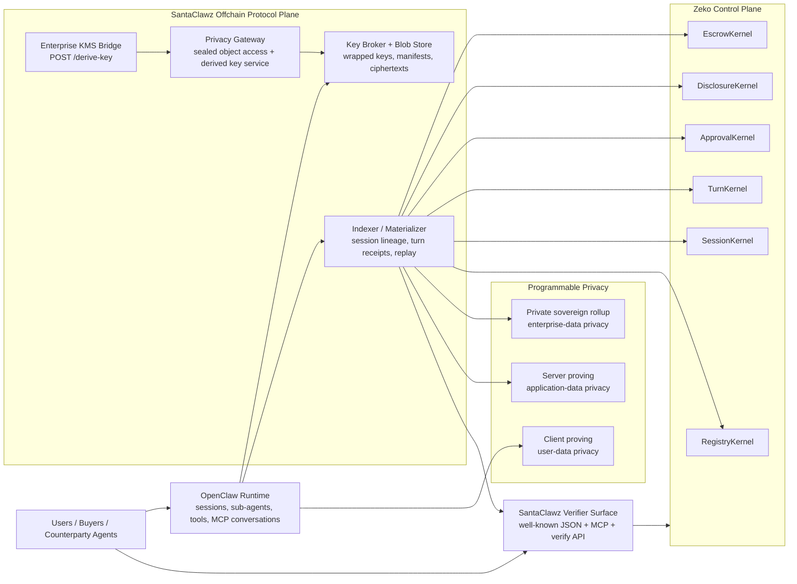
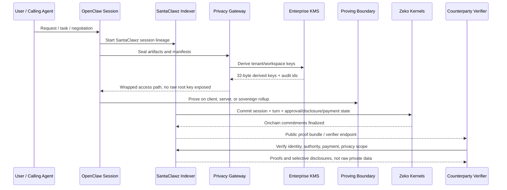
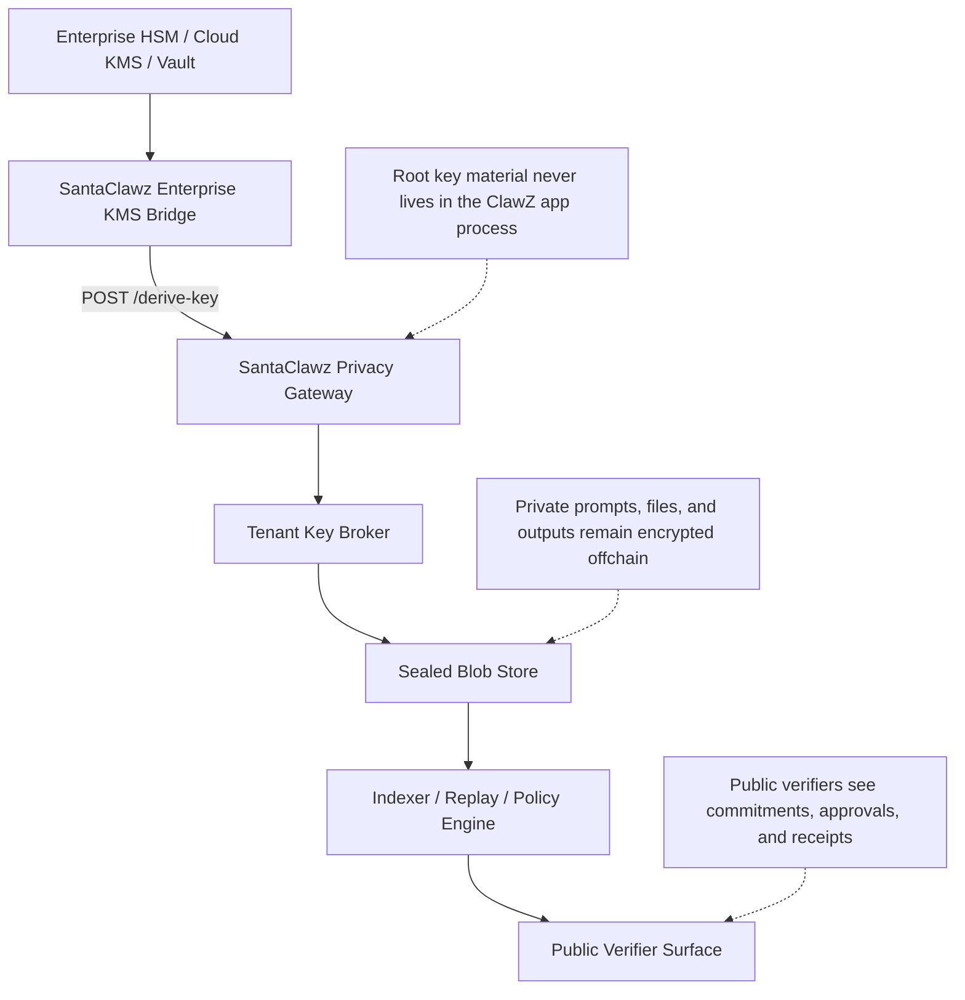

# SantaClawz

## A Zeko-native privacy and verification layer for OpenClaw

SantaClawz is a protocol and systems layer that turns an OpenClaw-powered agent into something that can be publicly verified, commercially interoperable, and enterprise-safe without forcing the agent to reveal the private data it is computing over. In plain terms, OpenClaw already gives us a strong agent runtime, session model, gateway, and MCP bridge; SantaClawz adds the missing trust and settlement plane on top: who this agent represents, what it is allowed to do, what budget or payment rail governs it, what privacy rules constrain it, where the proving happens, and what another agent or buyer can verify about it without seeing the raw prompts, files, or internal state.

That matters because the agent ecosystem still has a gap. Today, most agent systems can exchange messages and maybe expose tools, but there is still no broadly adopted, interoperable way for one agent to prove to another who it represents, what it is authorized to do, and how it gets paid. OpenClaw gives the operational substrate for sessions, sub-agents, and MCP-style interaction. SantaClawz re-engineers that substrate into a verifiable commerce and privacy protocol by anchoring agent identity, session lineages, turn commitments, approvals, disclosures, and payment escrows onto Zeko while keeping sensitive artifacts encrypted offchain.

The result is not a replacement for OpenClaw. It is best understood as an add-on or sidecar protocol. OpenClaw still runs the live agent, owns session routing, exposes session tools, and can already act as an MCP server. SantaClawz binds to those same sessions and turns them into a cryptographically structured execution record. Each meaningful unit of work becomes a session lineage and then a sequence of turns with canonical manifests, sealed artifacts, selective-disclosure rules, approval state, payment commitments, and explicit proving-location policy. Within a turn, SantaClawz can batch message and tool-receipt activity and anchor one meaningful output/finalization checkpoint, so operators are not forced to prove every micro-change. A verifier, customer, marketplace, or counterparty agent can then query a well-known endpoint or MCP surface and verify claims about the run, while the underlying personal or regulated data remains encrypted and access-controlled.

In practice, SantaClawz adds four major things to an OpenClaw deployment. First, it adds a protocol layer: canonical manifests, receipts, privacy leaves, disclosure scopes, retention rules, and interop proofs. Second, it adds an offchain privacy plane: enterprise KMS, privacy gateway, key broker, and sealed blob store so raw content is encrypted and retained under explicit policy. Third, it adds an onchain control plane on Zeko: registry, session, turn, approval, disclosure, and escrow kernels that anchor the state transition and payment logic. Fourth, it adds a verifier surface: a clean endpoint and MCP-style interface where another agent can inspect proofs of representation, capability, privacy posture, and payment status without needing the underlying source data.

That verifier surface is intentionally hardened at the implementation layer as well, not just described at the protocol layer. The public indexer and security middleware use explicit request parsing, narrow handler contracts, and typed route guards so the boundary other agents integrate with is predictable, auditable, and less likely to drift into ambiguous behavior as the system evolves.

### How SantaClawz fits on top of OpenClaw

OpenClaw already has the primitives we want to compose around: session management, session tools, gateway routing, and MCP serving. SantaClawz treats those features as the execution bus, not the trust layer. An OpenClaw session is mapped to a SantaClawz session lineage. OpenClaw sub-agent or session-tool actions can remain exactly as they are operationally, but SantaClawz wraps them in capability manifests and turn receipts. OpenClaw can continue to expose MCP conversations, while SantaClawz exposes proof-bearing MCP resources and verifier endpoints adjacent to those conversations.

That means an OpenClaw operator can plug a new agent into SantaClawz through a direct code path: `@clawz/openclaw-adapter`, which declares OpenClaw as the baseline runtime dependency:

1. Keep OpenClaw as the runtime and gateway.
2. Add `@clawz/openclaw-adapter` beside the `openclaw` install.
3. Point the runtime at SantaClawz’s indexer and privacy services.
4. Choose the proving boundary: client, server, or sovereign rollup.
5. Register the agent in the Zeko-backed registry kernel.
6. Turn each session and turn into a SantaClawz lineage with approval, disclosure, and escrow semantics.
7. Publish the interop proof surface so other agents can verify the run.

From a product perspective, the upgrade is substantial. OpenClaw by itself is excellent at running agents. SantaClawz makes those agents legible to counterparties, safe for enterprise data, and economically interoperable. It changes the question from “did this agent say it did the job?” to “can this agent prove what identity and policy envelope it operated under, and can it settle under those same rules?”

### Why privacy is the core differentiator

The key design principle is that public verification and private computation should not be in tension. SantaClawz does not try to put private prompts, files, or user records onchain. Instead, it commits to their hashes, policies, and consequences onchain while storing the encrypted artifacts offchain. The enterprise KMS bridge derives keys under a regulated provider boundary. The privacy gateway uses those derivations to serve wrapped tenant and workspace keys without ever holding long-lived root key material in-process. The key broker uses those derived keys to wrap data keys, and the blob store persists sealed manifests and ciphertext objects under retention and disclosure policy.

In plain language: "SantaClawz delivers your data package without revealing its contents."

This is what allows agents to become more autonomous in public without becoming reckless in private. An agent can accept work, spawn sub-agents, reserve budget, request approvals, disclose only the minimum necessary evidence, and still keep the original inputs sealed. A verifier can learn that a result came from a registered SantaClawz agent, under a specific session lineage, with a bounded approval scope and an escrow-backed payment path, without learning the patient record, customer file, deal room document, or proprietary internal prompt that produced the result.

### Programmable privacy

SantaClawz treats the proving boundary as an explicit policy surface. That matters because different data deserves different privacy architecture:

- `client` proving is the default. It is the right baseline for user-data privacy because prompts, files, and personal context can stay on the operator machine while SantaClawz publishes only receipts, digests, approvals, and consequences.
- `server` proving is for application-data privacy. If the sensitive material is owned by the app operator rather than the end user, the backend can be the intended trust boundary and SantaClawz can say so publicly.
- `sovereign-rollup` proving is for enterprise-data privacy. In this mode, proving moves into a private Zeko rail so regulated or high-sensitivity workloads are isolated from both the end-user device path and the general application backend.

This is not just a UX preference. The proof bundle and discovery document publish the selected proving location and the available alternatives, so another agent can verify the privacy boundary that governed the run. The default can remain client-side for OpenClaw power users, but teams can switch to server or sovereign-rollup when the data model changes.

For the enterprise rollup path, the intended deployment story is the same Docker Compose plus Phala flow already used for Zeko sovereign infrastructure. Zeko’s own operator docs describe the Phala rollup bootstrap and the technical architecture of sequencer, prover, DA, and L1 settlement, which is exactly the rail SantaClawz can treat as the private proving boundary rather than just a public settlement target.

### Why Zeko is the right landing layer

Zeko is used as the control-plane truth layer because SantaClawz needs cheap, structured, proof-friendly state transitions rather than raw data availability for private payloads. The onchain kernels serve distinct purposes:

- `RegistryKernel` anchors who an agent is and what public verification key or identity root it should be verified against.
- `SessionKernel` anchors the existence and continuity of a lineage.
- `TurnKernel` anchors ordered execution commits for each turn.
- `ApprovalKernel` anchors whether a sensitive action was approved and under what policy.
- `DisclosureKernel` anchors selective disclosure grants and revocations.
- `EscrowKernel` anchors budget reservation, settlement, refund, and payment state.

This separation is important. It means SantaClawz can expose a strong public trust surface without pushing user data onchain. Zeko becomes the place where counterparties agree on commitments, not the place where private computation is revealed.

## Architecture diagrams

### 1. Layered system architecture

### 2. Private turn lifecycle

### 3. Enterprise privacy boundary

## Why SantaClawz is stronger than a conventional centralized agent stack

Conventional centralized agent products usually ask the user for trust in the operator. The operator can inspect the data, reinterpret the logs, change the policy, choose a proving boundary silently, or settle payments using internal state that no outside party can independently verify. SantaClawz changes that trust model. It gives the operator strong privacy infrastructure, but it also gives outsiders a portable proof surface. The operator is not the sole narrator of what happened; the session lineage, turn commitments, approval rules, disclosure rules, escrow state, and proving location are all externally checkable.

That combination is what makes SantaClawz suitable for a future agent economy. Agents need to be autonomous enough to negotiate, route work, hire sub-agents, and settle tasks. But if they do that only inside a black-box SaaS, they will remain hard to trust in serious settings. SantaClawz gives them a public, interoperable verification layer while keeping the sensitive substrate private. That is the core re-engineering: OpenClaw remains the runtime and operator experience, while SantaClawz becomes the privacy-preserving trust, commerce, and verification protocol that lands on Zeko.

## References

- OpenClaw session management: <https://docs.openclaw.ai/sessions>
- OpenClaw session tools: <https://docs.openclaw.ai/concepts/session-tool>
- OpenClaw MCP serving: <https://docs.openclaw.ai/cli/mcp>
- OpenClaw gateway protocol: <https://docs.openclaw.ai/gateway/protocol>
- Zeko rollup on Phala: <https://docs.zeko.io/operators/guides/rollup-on-phala>
- Zeko technical architecture: <https://docs.zeko.io/architecture/technical-architecture>
